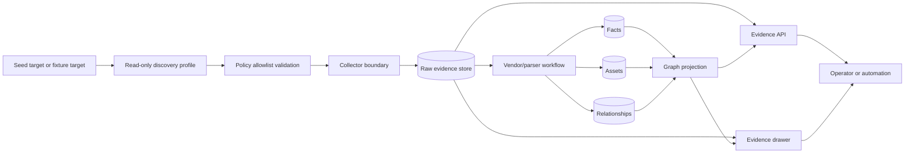

# Evidence-First Knowledge Pipeline

Truthwatcher's core path is intentionally evidence-first: raw read-only collection output is persisted before the system creates facts, assets, relationships, graph views, or agent answers.

## Why this is the correct path

Inventory without evidence becomes another unsupported source of truth. Truthwatcher therefore stores evidence first and treats all derived model records as explainable outputs of that evidence chain.

This decision is reinforced by:

- The project principle that Truthwatcher should not claim something is true unless it can show supporting evidence or mark it as seeded, inferred, conflicting, or unknown. See [README.md](../../README.md#core-principle).
- The evidence concept doc, which defines evidence as the durable audit trail for what was collected, where it came from, when it was collected, which command or API produced it, and which parser interpreted it. See [docs/concepts/evidence-first.md](../concepts/evidence-first.md).
- The asset model, which requires facts and relationships to carry source, confidence, state, and evidence references when observed. See [docs/concepts/assets-facts-relationships.md](../concepts/assets-facts-relationships.md).
- The API workflow, where discovery execution stores raw evidence and parsing is a separate explicit step. See [docs/api.md](../api.md#discovery-runs).

## Traceability impact

The diagram preserves a backward path from UI/API answers to graph data, relationships, assets, facts, parser output, and raw evidence. That is the system property that lets an operator ask, "Why do we believe this?" instead of only seeing the final modeled value.
