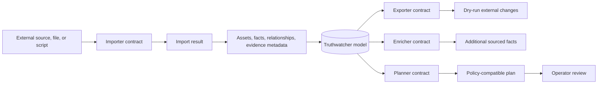

# Import, Export, And Extensibility Boundaries

Truthwatcher supports import/export and extension points through explicit contracts around the evidence-first data model. Extensions should add or project model data without bypassing safety, confidence, or traceability rules.

## Why this is the correct path

Extensibility should not become an escape hatch around the evidence and safety model. Contracts make integrations testable, dry-run friendly, and compatible with the same assets/facts/relationships vocabulary used by core discovery.

This decision is reinforced by:

- The extensibility concept doc, which describes compile-time contracts for imports, exports, enrichment, and planning. See [docs/concepts/extensibility.md](../concepts/extensibility.md).
- The import/export docs, which describe file-based import/export workflows and dry-run behavior. See [docs/import-export.md](../import-export.md).
- The local knowledge docs, which explain how local files and scripts can provide context while staying inside controlled interfaces. See [docs/local-knowledge.md](../local-knowledge.md).
- The extensibility contracts package, which defines typed importer, exporter, enricher, and planner interfaces. See `internal/extensibility/contracts.go`.
- The script runner implementation, which treats scripts as bounded import sources rather than arbitrary automation. See `internal/extensibility/script_runner.go`.

## Traceability impact

Import/export flows can participate in the same reviewable model as discovery: data has a source, exported changes can be previewed, and extensions are constrained to contracts that preserve the distinction between imported context, observed evidence, inferred facts, and planned actions.
