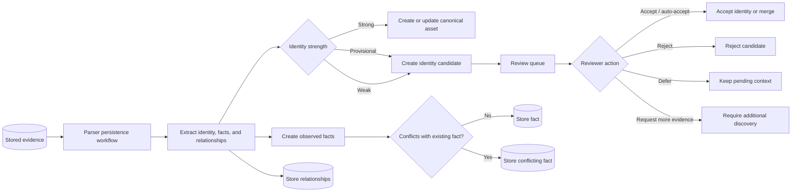

# Parsing And Identity Review

Parsing turns stored evidence into model changes while preserving uncertainty. Strong identities can produce canonical assets; provisional, weak, or conflicting identities remain reviewable instead of being silently merged.

## Why this is the correct path

Network identities are messy: hostnames can be reused, management IPs can move, and imported records can disagree with device evidence. Truthwatcher must therefore model identity confidence explicitly and avoid destructive overwrites.

This decision is reinforced by:

- The assets/facts/relationships concept doc, which defines strong, provisional, and weak identities and explains why hostnames and IP addresses are not reliable global identities. See [docs/concepts/assets-facts-relationships.md](../concepts/assets-facts-relationships.md#assets).
- The same concept doc's conflict behavior, which states that new disagreeing facts are stored as `conflicting` instead of overwriting existing facts. See [docs/concepts/assets-facts-relationships.md](../concepts/assets-facts-relationships.md#confidence-and-state).
- The identity lifecycle planning analysis, which captures the need for review queues, more-evidence states, and non-destructive identity decisions. See [docs/planning/identity-lifecycle-analysis.md](../planning/identity-lifecycle-analysis.md).
- The parser identity candidate model, which defines review states and actions such as accept, reject, defer, and request more evidence. See `internal/parser/identity_candidates.go`.

## Traceability impact

The parser does not merely output inventory rows. It records why an identity was trusted, why a candidate needs review, and which evidence supports facts and relationships. This gives operators a defensible path from raw device output to accepted model state.
