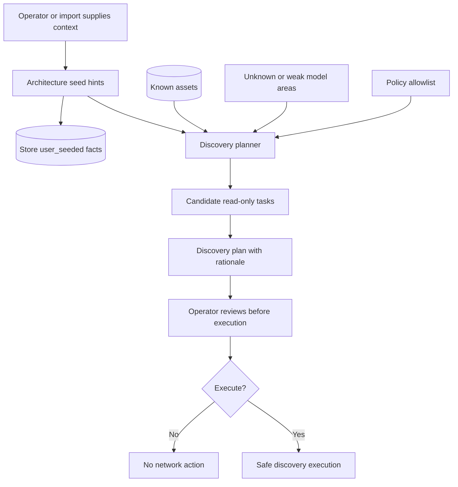

# Planning And Seeded Context

Architecture seeds and discovery plans help Truthwatcher decide what to collect next, but seeded context is intentionally not treated as observed proof.

## Why this is the correct path

Seeded context is useful for planning, but treating it as evidence would weaken the product's trust model. The correct separation is: seeds guide discovery and explain intent, while collected evidence proves observed facts.

This decision is reinforced by:

- The README safety model, which states seeded architecture hints are context, not observed proof. See [README.md](../../README.md#safety-model).
- The evidence-first concept doc, which explicitly says seeded context is not evidence and should not be confused with device proof. See [docs/concepts/evidence-first.md](../concepts/evidence-first.md#seeded-context-is-not-evidence).
- The architecture seed API docs, which describe seed hints as planning context. See [docs/api.md](../api.md#architecture-seeds).
- The planner package, which generates recommended read-only tasks and rationales from known assets, requested tasks, policy, and architecture hints. See `internal/planner/planner.go`.
- The seeding service, which normalizes architecture hints into model inputs without claiming they were observed from devices. See `internal/seeding/seeding.go`.

## Traceability impact

Operators can distinguish "the system observed this" from "a human seeded this as context." That distinction is essential for auditability, conflict review, and safe future automation.
