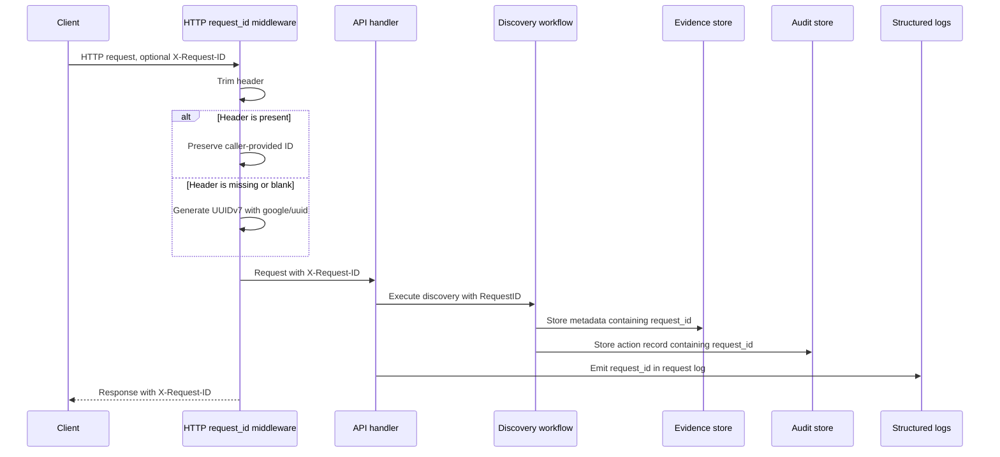

# Request Traceability

Every HTTP request receives an `X-Request-ID`. Caller-provided IDs are preserved, and missing or blank IDs are generated with UUIDv7 so they are globally unique and time-sortable.

## Why this is the correct path

Request IDs are the minimum viable correlation key before authentication exists. A UUIDv7 ID gives the system uniqueness, sortability by embedded time, and easy log/API/audit correlation without inventing a custom ID format.

This decision is reinforced by:

- The middleware implementation that trims the incoming header, calls `uuid.NewV7()` when the header is absent, sets the ID on the downstream request, and returns it on the response. See `internal/api/api.go`.
- The middleware tests that verify caller IDs are preserved and generated IDs are canonical UUIDv7 values. See `internal/api/api_test.go`.
- The traceability guide, which defines the request ID as the edge correlation key for discovery context, evidence metadata, audit rows, and logs. See [docs/traceability.md](../traceability.md#request-ids).
- The discovery workflow, which accepts a request ID and propagates it into seed input, evidence metadata, and audit records. See `internal/discovery/workflow.go`.
- The audit model, which stores `request_id` as a first-class attribute on discovery actions. See `internal/audit/audit.go`.

## Traceability impact

An operator can copy a response `X-Request-ID`, search request logs, find the discovery execution, inspect audit rows, and connect the same operation to evidence and downstream model updates. Authentication can later add actor identity, but it does not replace request-level correlation.
