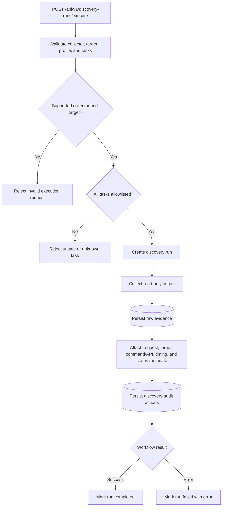

# Safe Discovery Execution

Discovery is designed as a read-only workflow. The API validates the collector, target, profile, and requested tasks before collection begins, then stores raw evidence and audit records for the action lifecycle.

## Why this is the correct path

Truthwatcher's safety model depends on proving that discovery cannot silently become configuration automation. Validation and policy checks therefore happen before collection, and collection output is stored before parsing or modeling.

This decision is reinforced by:

- The README safety model, which states Truthwatcher is read-only by design and that dangerous commands are denied. See [README.md](../../README.md#safety-model).
- The discovery concept doc, which explains fixture-backed discovery and the current no-network fake collector boundary. See [docs/concepts/discover-how-to-discover.md](../concepts/discover-how-to-discover.md).
- The API docs, which describe discovery execution as evidence-first and limited to explicit profile/task validation. See [docs/api.md](../api.md#discovery-runs).
- The policy engine, which centralizes allowlist validation and denies dangerous command patterns. See `internal/policy/policy.go`.
- The discovery workflow, which records evidence and audit rows during execution. See `internal/discovery/workflow.go`.

## Traceability impact

Each discovery action produces enough context to explain what ran, why it was allowed, what raw output was collected, when it happened, whether it completed, and which request initiated it. That makes discovery reviewable and safe to expose through UI and API workflows.
